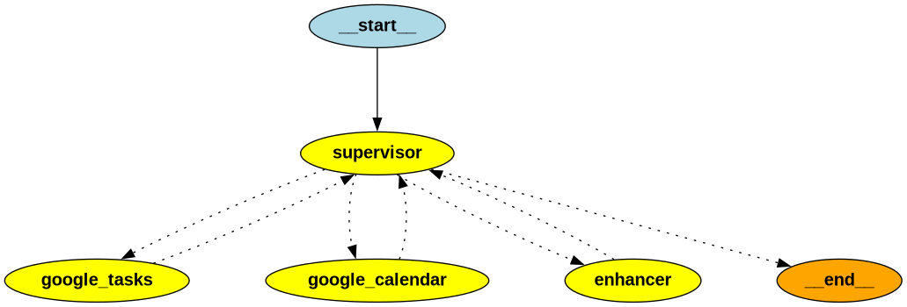

# Multi-Agent Functions Project

## Final Notes from Author

*   **LangGraph:** LangGraph proved to be super useful for orchestrating the multi-agent system and defining the complex state transitions.
*   **Future Improvements:**
    *   **Pydantic Models for Client Implementation:** Using Pydantic models for client implementations would enhance data validation and structure, making API interactions more robust and less error-prone.
    *   **More Structured Output for Enhancer:** Specifying a more structured output for the Enhancer agent would improve the clarity and reliability of subtask delegation, ensuring that the Supervisor receives consistent and easily parsable instructions.
*   **Project Accomplishments:** This project successfully accomplished its goal of orchestrating multi-agent systems with information carried between specialized agents. Specifically, it demonstrated the ability to handle a complex task like "could you create an event called warframes for 9 am tomorrow, for 30 minutes with a description of all the tasks in my warframe tasklist, then afterwards add the event id to the tasklist." While the current implementation might not be fully stable for production, the primary objective was to explore and demonstrate a solution approach for such multi-agent coordination.

This project implements a multi-agent system designed to assist users with tasks related to Google Calendar and Google Tasks. The system is orchestrated by a central Supervisor agent that delegates tasks to specialized worker agents.

## Supervisor Graph Structure

The core of this multi-agent system is the Supervisor Graph, which manages the flow of information and control between different agents. The graph ensures that user requests are routed to the most appropriate agent for processing and that complex tasks are broken down and coordinated effectively.

Here's a visual representation of the Supervisor Graph:

### Components of the Supervisor Graph:

*   **Supervisor Node:** This is the central decision-making node. It receives user requests and responses from other agents. Based on the input, it determines the next action:
    *   Delegating the request to a specialized worker agent (Enhancer, Google Tasks Expert, Google Calendar Expert).
    *   Concluding the conversation if the user's query is complete (`__end__`).
    The Supervisor is responsible for coordinating multi-agent workflows and ensuring a coherent interaction with the user.

*   **Agent Nodes (google_tasks, google_calendar, enhancer):** These nodes represent the specialized worker agents. When the Supervisor delegates a task to one of these nodes, the corresponding agent processes the task and then returns control back to the Supervisor.

### Workflow:

1.  A user initiates a request.
2.  The request first goes to the **Supervisor Node**.
3.  The Supervisor analyzes the request and decides which agent is best suited to handle it:
    *   If the request is complex or requires breaking down into multiple steps, it delegates to the **Enhancer Agent**.
    *   If the request directly pertains to Google Tasks, it delegates to the **Google Tasks Expert Agent**.
    *   If the request directly pertains to Google Calendar, it delegates to the **Google Calendar Expert Agent**.
4.  The selected agent performs its specific task.
5.  After completing its task, the agent sends its response back to the **Supervisor Node**.
6.  The Supervisor then evaluates the agent's response and decides the next step:
    *   Delegating another subtask (if the Enhancer has provided a sequence of steps).
    *   Asking for more information from the user.
    *   Providing a final answer and ending the conversation (`__end__`).

## Worker Agents

The system utilizes several specialized worker agents, each with distinct responsibilities:

*   **Supervisor Agent:**
    *   **Role:** The orchestrator of the multi-agent system.
    *   **Responsibilities:** Routes user requests to the correct specialized agent, coordinates multi-agent workflows, processes information received from agents, and determines when the user's overall request is complete. It can also ask for more information from the user if needed.

*   **Enhancer Agent:**
    *   **Role:** Breaks down complex user requests into smaller, actionable subtasks.
    *   **Responsibilities:** Takes a broad user request and transforms it into a sequence of specific tasks, each designed to be handled by either the Google Tasks Expert or the Google Calendar Expert. It specifies which agent should handle each step and provides necessary details.

*   **Google Tasks Expert Agent:**
    *   **Role:** Manages Google Tasks.
    *   **Responsibilities:** Interacts with the Google Tasks API to perform operations such as:
        *   Listing, creating, updating, and deleting task lists.
        *   Listing, creating, updating, and deleting individual tasks within a task list.
        *   Marking tasks as complete or clearing completed tasks.

*   **Google Calendar Expert Agent:**
    *   **Role:** Manages Google Calendar events and calendars.
    *   **Responsibilities:** Interacts with the Google Calendar API to perform operations such as:
        *   Listing, creating, updating, and deleting calendars.
        *   Listing, creating, updating, and deleting events.
        *   Handling recurring events and quick add functionalities.
        *   Clarifying ambiguous time references with the user.
